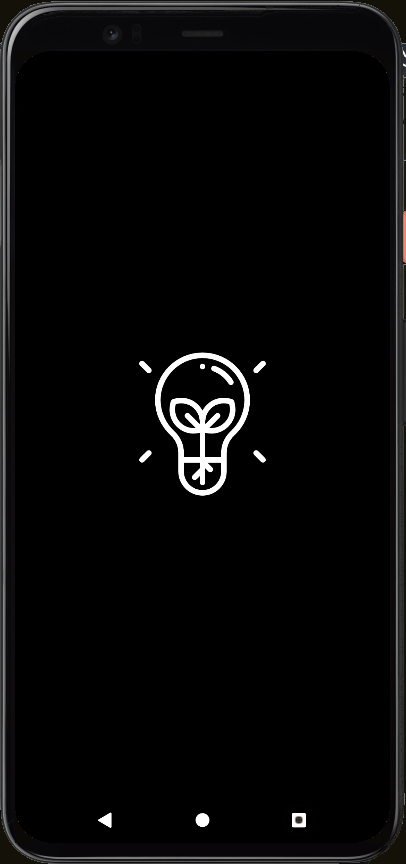

# Flashlight
### Desenvolvimento de um aplicativo mobile de lanterna, utilizando React Native.

- Funcionalidades
  - Lanterna liga/desliga ao apertar na figura da lanterna
  - Lanterna liga/desliga ao chacoalhar o aparelho

